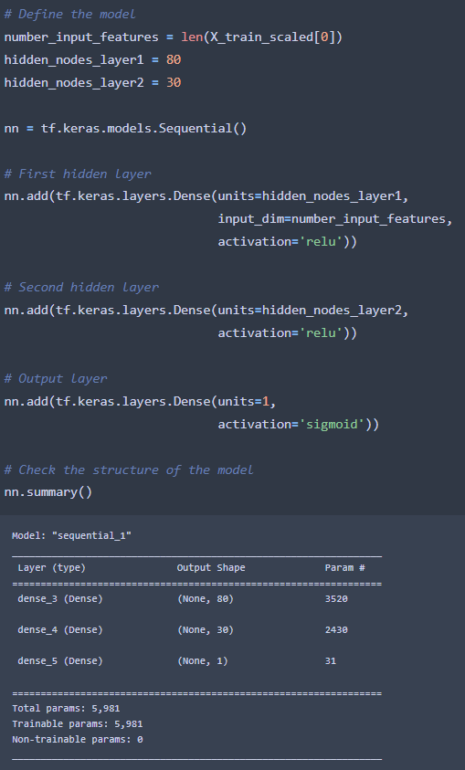
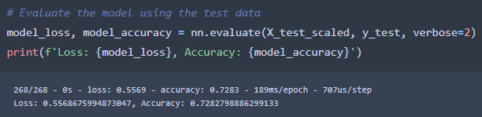
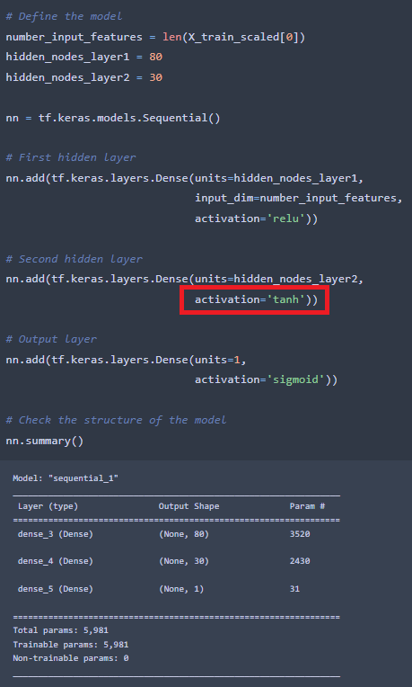
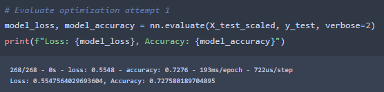
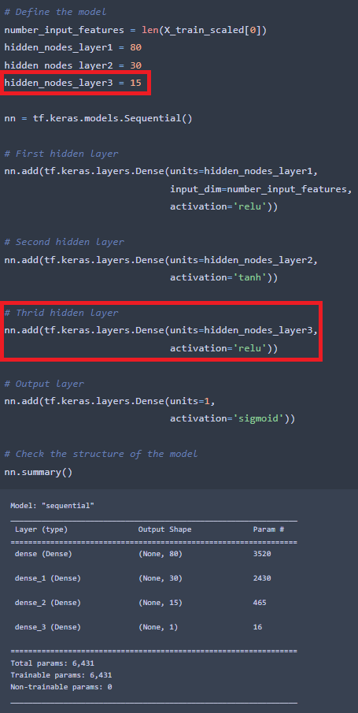
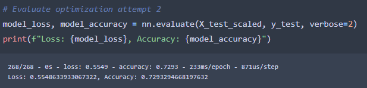
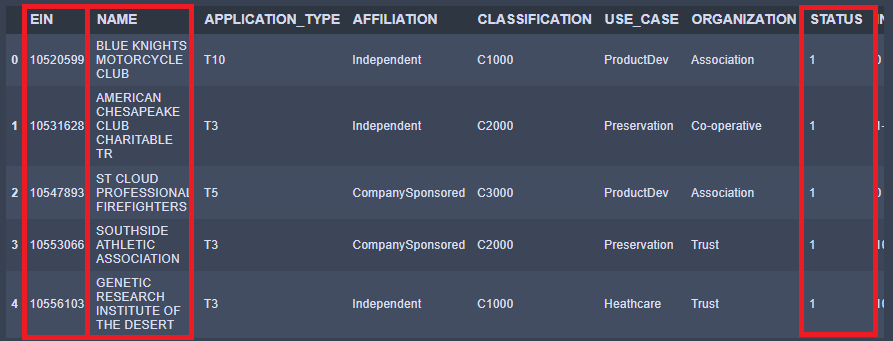
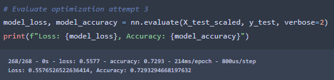

# Neural_Network_Charity_Analysis

## **Overview**
The purpose of this project was to preprocess the provided data and then compile, train, and evaluate a deep-learning neural network. We then needed to make three attempts to optimize our model to try and improve its accuracy by changing things within the data or the model itself.

## **Resources**
*   **Data Source:** 
    *   [charity_data.csv](resources/data/charity_data.csv)
*   **Software:**
    *   Anaconda 4.11.0
    *   Jupyter Notebook 6.4.5
    *   Python 3.9.7
        *   Pandas 1.3.4
        *   SciKit-Learn 0.24.2
        *   Tensorflow 2.8.0
    *   Visual Studio Code 1.63.2

## **Results**
The following questions were provided and required bulleted answers per the assignment instructions.
*   Data Preprocessing
    *   What variable(s) are considered the target(s) for your model?
        *   The target variable is the `IS_SUCCESSFUL` column.
    *   What variable(s) are considered to be the features for your model?
        *   All other variables are considered the features. These include: ```APPLICATION_TYPE, AFFILIATION CLASSIFICATION, EIN, NAME, USE_CASE, ORGANIZATION, STATUS, INCOME_AMT, and SPECIAL_CONSIDERATIONS```
    *   What variable(s) are neither targets nor features, and should be removed from the input data?
        *   The variables that should be removed are the `EIN` and `NAME` columns, and in optimization attempt three I removed the `STATUS` column.
*   Compiling, Training, and Evaluating the Model
    *   How many neurons, layers, and activation functions did you select for your neural network model, and why?
        *   The model consisted of two hidden layers with 80 and 30 neurons each respectfully. The activation functions for each hidden layer was `relu` and the output layer was `sigmoid`. These activations were selected because they were the best choice for this dataset, binary classification (i.e. was our target outcome true or false).
    *   Were you able to achieve the target model performance?
        *   I was not able to reach the target model performance of 75% accuracy.
    *   What steps did you take to try and increase model performance?
        * My first attempt involved changing the activation of the second hidden layer. My second attempt added a third hidden layer. My third attempt dropped the `STATUS` column since it was not well defined and could have been adding confusion to the model.

### **Original Processing**
The first round of preprocessing I dropped the `EIN` and `NAME` identifier columns from the DataFrame, since they more than likely confused the model. I also bucketed the `APPLICATION_TYPE` and `CLASSIFICATION` columns to reduce the number of types that were present in each. The rarest of the types in each column were sorted into an "Other:" category based on the density of the data which was visualized using the `plot.density()` function. After these actions, I encoded the data using the `OneHotEncoder()` function to make the information easier of the model to interpret. 

Following the preprocessing the `IS_SUCCESSFUL` column was made the target, data was split between training and testing, and scaled and fit using `StandardScaler()`. 

The model used has two hidden layers, the first with 80 nodes and the second with 30. Both layers used the `relu` activation and the output layer used `sigmoid` activation. After compiling, training, and evaluation our results were a data loss of **0.557** and an accuracy of **0.728**.





## **Optimizations**

### **Attempt One**
I followed the same preprocessing as the original, but for my first attempt to optimize the model I changed the second layer's activation from `relu` to `tanh`. My reasoning behind this was to see if changing the activation could make up for the data loss and improve the accuracy. The results of this change were a data loss of **0.555** and an accuracy of **0.728**





### **Attempt Two**
Jumping from the last attempt I decided to add a third hidden layer to see if the extra layer would improve the accuracy. This third layer has half as many nodes as the second layer, 15. In addition, I kept the second layers `tanh` activation since it did not seem to improve or worsen the model. The results of this change were a data loss of **0.555** and an accuracy of **0.729**





### **Attempt Three**
Since the first two attempts did little to nothing to improve the accuracy, I decided to go into the data to see if there was anything else that could potentially be confusing the model. For my third optimization, in addition to dropping the `EIN` and `NAME` columns, I also dropped the `STATUS` column from the original DataFrame. My reasoning for this is because `STATUS` was not well defined and was possibly doing little to nothing to help the model. The model parameters from the second attempt was used again in this attempt. The results of this change were a data loss of **0.557** and an accuracy of **0.729**





## **Summary**
Each of my optimization attempts made little to no impact on the model's data loss and accuracy per the evaluation results. This may be due to the fact that I built each attempt off of the pervious attempt rather than reverting to the original model. The poor performance of these models may also be from over complication of the hidden layers. Further attempts to optimize should include reducing the number of hidden layers and/or decrease the neuron counts per layer. In addition, a different model all together may be more suitable for this dataset. Considering that we are trying to perform find predict a binary outcome, a logistic regression model may be better in this specific circumstance rather than a deep learning model.